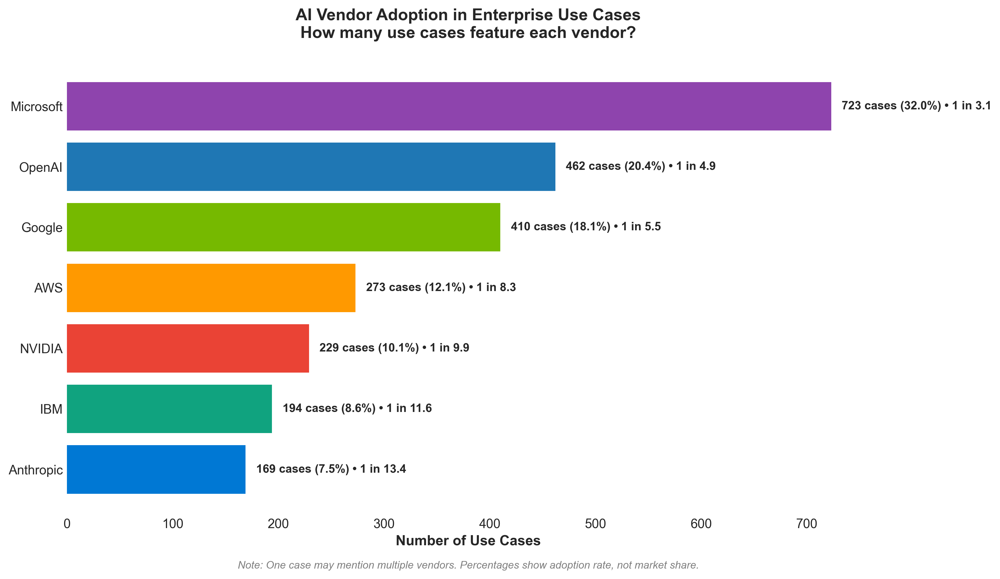
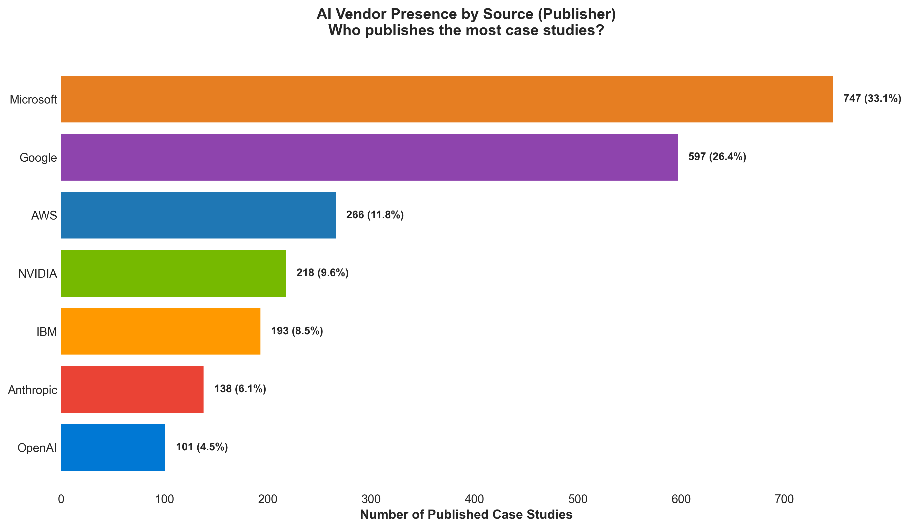

# AI Use Cases Library – Charts Gallery

This page collects the main charts derived from the dataset of 3,023 curated AI use cases.  
For raw PNGs, see the [charts folder](./).

---

## Industry Distribution

---

## Use Case Domains

---

## Outcomes & Benefits

---

## Vendor Presence by Tool/Technology

---

## Vendor Presence by Source (Publisher)

---

*Note: More visuals may be added in future releases (see [ROADMAP](../ROADMAP.md)).*

---
 

> ➡️ Back to [README](../README.md) · See analysis in [Trends](../insights/trends-analysis.md) or [Vendor Comparison](../insights/vendor-comparison.md)