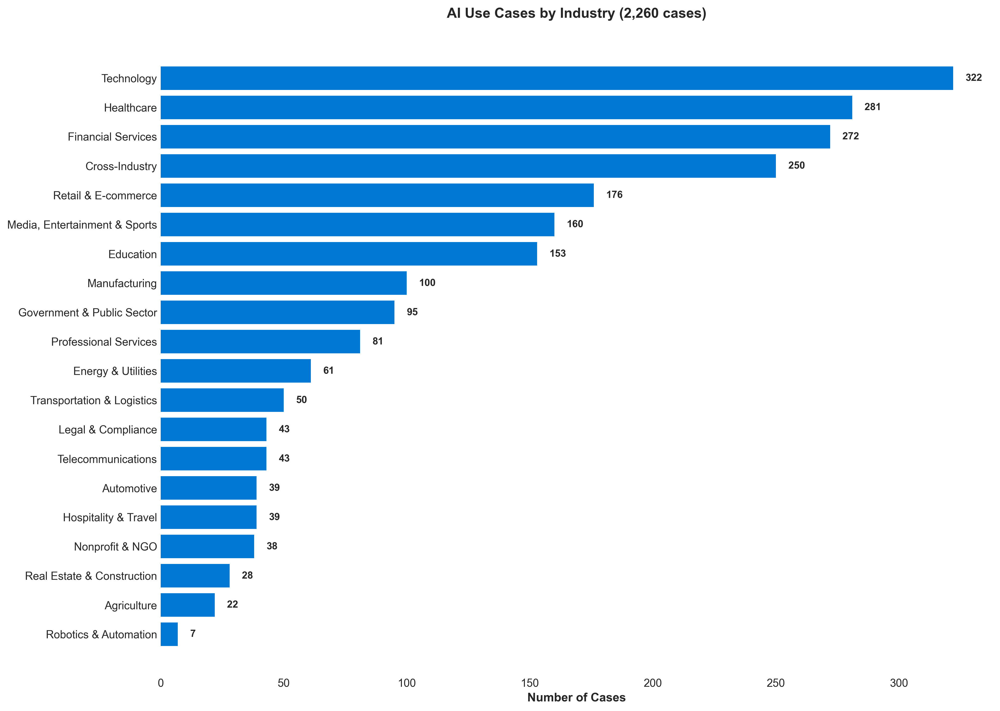

# Trends Analysis: What 2,260 AI Use Cases Reveal

Based on a review of 2,260 AI use cases, six major trends emerged. These patterns show AI moving from *basic automation* toward *transforming industries* with measurable outcomes at scale.

---

## 📊 Technology Maturity

**Production-Ready**
- RAG/Embeddings - 981 cases (43% adoption)
- Function calling - 273 cases
- Domain copilots - 333 cases

**Growing**
- Agentic AI - 265 cases 📈
- Multimodal - 185 cases 📈

**Emerging**
- Reasoning models - 20 cases 🚀
- Computer use - 13 cases 🚀

---

## 🚀 Emerging Tech: Reasoning Models

Next-generation models (o1, o3, GPT-5) deliver **50–70% improvements in complex tasks** such as code review, financial analysis, legal work, and rare disease diagnosis.

- **CodeRabbit**: 50% faster pull requests, 60x ROI (`aicase-00018`)
- **Endex**: First autonomous financial analyst (`aicase-00027`)
- **Hebbia**: Automates up to 90% of finance/legal work (`aicase-00040`)
- **Factory**: AI-orchestrated software development (`aicase-00029`)

**Takeaway:** Reasoning LLMs are unlocking workflows that once required expert human judgment.

---

## 🤖 Agentic AI Goes Mainstream

Multi-agent systems now handle complex workflows with **40–90% cost reductions** and growing trust in regulated industries.

- **Bito**: Agentic AI cuts dev cycle time by 89% (`aicase-00118`)
- **IBM HR**: watsonx Orchestrate automates 10M+ HR interactions annually (`aicase-00325`)
- **Grafana Labs**: Multi-agent observability assistant (`aicase-00153`)
- **Saarthi AI**: Voice agents reduce delinquency by up to 30% (`aicase-01973`)

**Takeaway:** Enterprises are deploying agentic AI at scale, from DevOps to HR to collections.

---

## 🧬 Healthcare Innovation

Healthcare leads in breakthrough applications — from drug discovery to diagnostics.

- **Paradigm**: AI matches patients to clinical trials 90% faster (`aicase-00072`)
- **Exscientia**: Generative AI designs new molecules 70% faster (`aicase-00651`)
- **Amgen**: Among the first organizations to adopt GPT-5 in drug development (`aicase-00004`)
- **NHS Grampian**: Breast cancer detection up 12%, notifications cut from 14 to 3 days (`aicase-01878`)
- **Boston Children’s Hospital**: Reasoning models uncover rare disease genes (`aicase-00016`)

**Takeaway:** AI is shifting from supporting healthcare to actively *driving discovery and diagnosis*.

---

## 🌍 Climate & Sustainability

AI is directly enabling more sustainable practices in agriculture and energy.

- **John Deere**: 70% less chemical use in precision farming (`aicase-00047`)
- **Charm Industrial**: AI-assisted carbon removal (`aicase-00128`)
- **AES**: 99% lower costs for renewable energy audits (`aicase-00103`)
- **Sencrop**: 76% of farmers adopted sustainable practices (`aicase-00767`)

**Takeaway:** AI is scaling climate solutions — cutting waste, boosting efficiency, and changing behaviors.

---

## 🎙️ Multimodal & Voice AI

Combining text, vision, and voice creates new possibilities in healthcare, coaching, and customer service.

- **10BedICU**: Cuts patient discharge time, connects 200+ hospitals in India (`aicase-00001`)
- **Retell AI**: Voice automation cuts call costs by 80% (`aicase-00077`)
- **Healthify**: Vision + coaching doubles engagement in health programs (`aicase-00039`)
- **Hume AI**: Emotionally intelligent voice interactions at scale (`aicase-00160`)

**Takeaway:** Multimodal AI is moving from demos to *real impact* in health and service industries.

---

## 🏭 Autonomous Systems & Domain Copilots

AI systems increasingly operate end-to-end with minimal supervision, delivering **60–99% cost reductions**.

- **Mercado Libre**: Cataloguing and fraud detection equivalent to 9,000 operators (`aicase-00061`)
- **Rakuten**: 7-hour autonomous coding sessions, 79% faster time-to-market (`aicase-00196`)
- **GitHub Copilot**: Widely adopted coding assistant, 55% faster task completion (`aicase-00035`) 
- **Nubank**: Copilot serves 114M customers with faster responses (`aicase-00068`)
- **Color Health**: AI copilot transforms cancer care workflows (`aicase-00020`)

**Takeaway:** Autonomous systems and copilots are moving beyond pilots into **mainstream enterprise adoption**.

---

# 📈 Summary

AI is no longer just automating tasks. It is:  
- **Reasoning** through complex decisions  
- **Orchestrating** workflows via agents  
- **Discovering** new drugs and diseases  
- **Powering** climate and sustainability solutions  
- **Communicating** through multimodal interaction  
- **Operating autonomously** in regulated industries  

These shifts point toward a future where AI doesn’t just *support work* — it increasingly **performs and scales work** itself.

---

## Charts

- 
- 
- 

  
➡️ See more visuals in the [charts folder](../charts/) or browse the [Charts Gallery](../charts/charts.md).

---
 

> ➡️ Back to [README](../README.md)