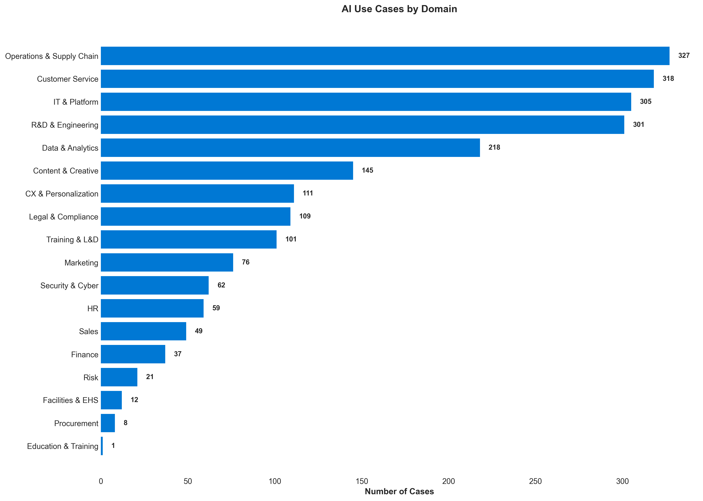

# Trends Analysis: What 3,023 AI Use Cases Reveal

Based on a comprehensive review of **3,023 AI use cases**, seven major trends have emerged. These patterns show AI evolving from *basic automation* toward *intelligent systems that reason, orchestrate, and transform industries* with measurable outcomes at massive scale.

---

## Technology Maturity

**Production-Ready & Scaling**
- **RAG/Embeddings** -  179 cases
- **Function calling** - 34 cases
- **Domain copilots** - 352 cases (widespread enterprise adoption)

**Rapidly Growing**
- **Agentic AI** - 224 cases (multi-agent orchestration mainstream)
- **Multimodal** - 288 cases (vision + voice + text)
- **Voice AI** - 184 cases (conversational interfaces everywhere)

**Emerging Powerhouses**
- **Reasoning models** - 26 cases (up from 17, +53% growth)
- **Computer use** - 13 cases (autonomous UI interaction)
- **Long context** - Enabling new use cases in legal, research, analysis

---

## Emerging Tech: Reasoning Models

Next-generation reasoning models deliver **50–70% improvements in complex tasks** such as code review, financial analysis, legal work, and rare disease diagnosis.

- **CodeRabbit**: 50% faster pull requests, 60x ROI with automated code review (`aicase-00018`)
- **Endex**: First autonomous financial analyst, processing complex market data (`aicase-00027`)
- **Hebbia**: Automates up to 90% of finance/legal document analysis (`aicase-00040`)
- **Factory**: AI-orchestrated end-to-end software development (`aicase-00029`)
- **Boston Children's Hospital**: Reasoning models identify rare disease genes faster than human experts (`aicase-00016`)
- **Harvey**: Advanced legal reasoning for contract analysis and case law research
- **Glean**: Reasoning-powered enterprise search understanding complex queries

**Takeaway**: Reasoning LLMs are unlocking workflows that once required expert human judgment.

---

## Agentic AI Goes Mainstream

Multi-agent systems now handle complex, multi-step workflows with **40–90% cost reductions** and growing trust in regulated industries:

### Enterprise-Scale Deployments:
- **Bito**: Agentic AI cuts dev cycle time by 89% across entire SDLC (`aicase-00118`)
- **IBM HR**: watsonx Orchestrate automates 10M+ HR interactions annually (`aicase-00325`)
- **Grafana Labs**: Multi-agent observability assistant handling complex debugging (`aicase-00153`)
- **Saarthi AI**: Empathetic voice agents reduce delinquency by 15-30%, cut collection costs 90% (`aicase-01973`)
- **Mercado Libre**: Autonomous fraud detection + cataloging = 9,000 operator equivalents (`aicase-00061`)
- **BBVA**: 2,900 custom GPTs deployed in 5 months, 83% employee weekly usage (`aicase-00009`)

**Takeaway**: Enterprises are deploying agentic AI at scale, from DevOps to HR to collections.

---

## Healthcare: From Support to Discovery

Healthcare leads in breakthrough applications, moving from *supporting workflows* to *actively driving discovery and diagnosis*:

### Drug Discovery & Development:
- **Exscientia**: Generative AI reduces required compounds 10x, cuts costs 80%, molecules now in clinical trials (`aicase-00651`)
- **Amgen**: Among first to adopt GPT-5 for accelerated drug development (`aicase-00004`)
- **Biomni**: Uses Claude to speed biomedical research by 100x (`aicase-00117`)

### Diagnostics & Patient Care:
- **NHS Grampian**: AI increases breast cancer detection by 12%, cuts notification time from 14 to 3 days (`aicase-01878`)
- **Paradigm**: AI matches patients to clinical trials 90% faster (`aicase-00072`)
- **Color Health**: Cancer care copilot streamlines oncology workflows (`aicase-00020`)
- **10BedICU**: Multimodal AI connects 200+ hospitals in India, reducing discharge times (`aicase-00001`)

### Research Acceleration:
- **Boston Children's Hospital**: Reasoning models uncover genetic causes of rare diseases (`aicase-00016`)
- **Columbia University**: Brain-to-speech translation using generative AI (`aicase-02191`)

**Key Insight**: AI is becoming a *research partner* and *diagnostic assistant*, not just an administrative tool. AI is shifting from supporting healthcare to actively driving discovery and diagnosis.

---

## Climate & Sustainability: Real-World Impact

AI directly enables sustainable practices across agriculture, energy, and manufacturing:

### Precision Agriculture:
- **John Deere**: Computer vision reduces chemical use by 70% while increasing yields (`aicase-00047`)
- **Sencrop**: 76% of farmers adopted sustainable practices through AI-driven insights (`aicase-00767`)
- **Opportunity International (Malawi)**: Azure chatbot delivers farming advice to smallholder farmers (`aicase-01899`)

### Energy & Carbon:
- **Charm Industrial**: AI accelerates carbon sequestration operations (`aicase-00128`)
- **AES**: 99% lower audit costs for renewable energy deployment (`aicase-00103`)

### Manufacturing Efficiency:
- **Microsoft Research**: AI discovered new battery chemistry with 70% less lithium (`aicase-01831`)

**Takeaway**: AI is scaling climate solutions – cutting waste, boosting efficiency, and changing behaviors.

---

## Multimodal & Voice AI: Breaking Communication Barriers

Combining text, vision, and voice creates breakthrough applications in healthcare, accessibility, and customer service:

### Voice & Conversational AI:
- **Retell AI**: Voice automation cuts call center costs by 80% (`aicase-00077`)
- **Hume AI**: Emotionally intelligent voice interactions at scale (`aicase-00160`)
- **Nubank**: Copilot serves 114M customers, reducing Tier 1 chat times by 70% (`aicase-00068`)

### Vision + Language:
- **Healthify**: Vision + coaching doubles engagement in health programs (`aicase-00039`)
- **Azure AI Vision**: Used across retail, manufacturing, and healthcare for visual QA

### Accessibility Impact:
- **Kilroy Blockchain**: Riley assistant designed for visually impaired users, enabling daily independence (`aicase-00344`)

**Takeaway**:  Multimodal AI is moving from demos to real impact in health and service industries.

---

## Autonomous Systems & Copilots: Operating at Scale

AI systems increasingly operate end-to-end with minimal supervision, delivering **60–99% cost reductions** and productivity gains:

### Autonomous Operations:
- **Rakuten**: 7-hour autonomous coding sessions, 79% faster time-to-market, near-perfect accuracy (`aicase-00196`)
- **Altera**: Autonomous digital humans operate independently for 4+ hours in virtual environments (`aicase-00003`)
- **micro1**: AI conducts 3,000+ technical interviews daily, reducing hiring costs 85% (`aicase-00179`)

### Domain Copilots:
- **GitHub Copilot**: Most widely adopted coding assistant—55% faster task completion (`aicase-00035`)
- **Microsoft 365 Copilot**: 168 documented enterprise deployments across industries
- **Notion AI**: 2M+ sign-ups, saves users 70 minutes per week (`aicase-00067`)

### Enterprise Automation:
- **Basis**: Accounting automation agents save 30% of firm time on reconciliations (`aicase-00008`)
- **Arizona State University**: AI successfully graded 20,000 students in one course, enabling scalable assessment (`aicase-00006`)

**Takeaway**: Autonomous systems and copilots are moving beyond pilots into mainstream enterprise adoption.

---

## New Capabilities: What's Now Possible

v2.0 reveals entirely new categories of AI applications:

### Cultural & Linguistic Preservation:
- **Government of Iceland**: Building AI models to protect and promote Icelandic language (`aicase-00036`)

### AI-to-Nature Interfaces:
- **Avanade Intelligent Garden**: Natural language interfaces allowing AI to "talk" to trees, monitoring plant health (`aicase-01482`)

### Financial Inclusion:
- **Saarthi AI**: Empathetic debt collection reduced delinquency while cutting costs up to 90% (`aicase-01973`)

### Democratized AI Development:
- **BBVA**: Created 2,900 custom GPTs in 5 months with 83% employee adoption (`aicase-00009`)

---

## Summary: Six Fundamental Shifts

AI is no longer just automating tasks. The data shows six fundamental transformations:

**1. Reasoning** through complex decisions
**2.Orchestrating** workflows via agents
**3. Discovering** new drugs and diseases
**4. Powering** climate and sustainability solutions
**5. Communicating** through multimodal interaction
**6. Operating autonomously** in regulated industries

These shifts point toward a future where AI doesn't just *support work*, it increasingly **performs, scales, and innovates** alongside humans.

---

## Charts

- 
- 
- 

➡️ See more visuals in the [charts folder](../charts/) or browse the [Charts Gallery](../charts/charts.md).

---

 

> ➡️ Back to [README](../README.md)
