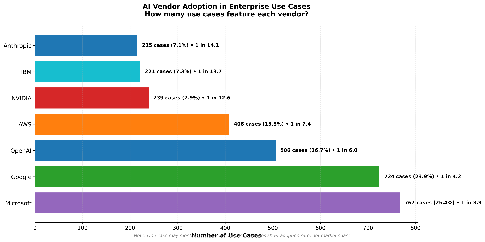

# Vendor Presence in Documented AI Use Cases

I analyzed **3,023 documented enterprise AI use cases** (up 34% from v1.0). Vendor presence was measured two ways:

1. **Tool/Technology mentions** → where a vendor's products appear in the Tool/Technology column.  
   - Captures multi-vendor adoption patterns
   - Shows technical footprint across use cases  
   - Reveals actual deployment choices

2. **Source (Publisher)** → who published the case study.  
   - Reflects marketing and publication activity
   - Vendors like Microsoft and Google publish far more case studies than others
   - Shows go-to-market strategy differences

> ℹ️ **Methodology Note:** These figures represent the *share of documented case studies in our dataset*, not true global market share. Vendors with larger publication pipelines (e.g., Microsoft, Google) appear prominently. See [README](../README.md) for full methodology.

---

## What Changed from v1.0 to v2.0

The additional 763 cases revealed **major shifts in vendor landscape**:

| Vendor | v1.0 Tools | v2.0 Tools | Change | % Growth |
|--------|------------|------------|--------|----------|
| **Google** | 409 | 724 | +315 | **+77%** 📈 |
| **Microsoft** | 749 | 767 | +18 | +2% |
| **OpenAI** | 460 | 506 | +46 | +10% |
| **AWS** | 301 | 408 | +107 | **+36%** 📈 |
| **Anthropic** | 169 | 215 | +46 | +27% |
| **NVIDIA** | 229 | 239 | +10 | +4% |
| **IBM** | 193 | 221 | +28 | +15% |

**Key Insight**: Google's explosive growth (+77%) driven by Gemini adoption shows the market expanding beyond Microsoft + OpenAI dominance.

---

## Vendor Presence by Tool/Technology

### Top 7 Vendors (by tool mentions):

| Rank | Vendor | Cases | Adoption Rate | Frequency |
|------|--------|-------|---------------|-----------|
| 1 | **Microsoft** | 767 | 25.4% | 1 in 3.9 |
| 2 | **Google** | 724 | 24.0% | 1 in 4.2 |
| 3 | **OpenAI** | 506 | 16.7% | 1 in 6.0 |
| 4 | **AWS** | 408 | 13.5% | 1 in 7.4 |
| 5 | **NVIDIA** | 239 | 7.9% | 1 in 12.6 |
| 6 | **IBM** | 221 | 7.3% | 1 in 13.7 |
| 7 | **Anthropic** | 215 | 7.1% | 1 in 14.1 |

### Key Observations:

**Microsoft's Enterprise Lock-In**
- Dominates through Azure + Copilot ecosystem integration
- 93% of "Copilot" mentions in our dataset
- Strong across Financial Services (96 cases), Healthcare (79 cases)
- Azure OpenAI Service: 349 mentions

**Google's Gemini Surge**
- Gemini appears in 405 cases (most-mentioned specific model)
- Leads in Retail & E-commerce personalization (45 cases)
- Vertex AI platform: 252 mentions
- Growth driven by multimodal capabilities and competitive pricing

**OpenAI's Innovation Leadership**
- GPT-4: 83 mentions
- Reasoning models (o1/o3) driving new use cases
- Strong in research, healthcare breakthroughs
- Despite fewer direct mentions, powers many Microsoft deployments via Azure OpenAI

**AWS Bedrock's Multi-Model Advantage**
- 201 mentions of Amazon Bedrock
- Flexibility to deploy multiple models (Anthropic Claude, Meta Llama, Mistral)
- SageMaker: 104 mentions for custom ML
- Strong in cost-sensitive, multi-cloud enterprises

**Anthropic's Quality Focus**
- Claude appears in 214 cases
- Favored by high-stakes applications (legal, healthcare, finance)
- Present in >50% of featured "high-impact" cases
- Growing in startups and technology sector (44 cases)

**NVIDIA's Infrastructure Dominance**
- Powers the infrastructure behind most vendors
- NIM (NVIDIA Inference Microservices): 7 direct mentions
- Actual usage far exceeds documented mentions

**IBM's Legacy Position**
- watsonx: 157 mentions
- Strong in Financial Services and established enterprises
- Growing slowly (+15% vs v1.0) compared to cloud-native competitors

---

## Vendor Presence by Source (Publisher)

### Publication Activity Rankings:

| Rank | Publisher | Published Cases | % of Dataset | Change vs v1.0 |
|------|-----------|-----------------|--------------|----------------|
| 1 | **Google** | 996 | 33.0% | +399 (+67%) 📈 |
| 2 | **Microsoft** | 755 | 25.0% | +8 (+1%) |
| 3 | **AWS** | 297 | 9.8% | +31 (+12%) |
| 4 | **NVIDIA** | 218 | 7.2% | 0 (0%) |
| 5 | **IBM** | 217 | 7.2% | +24 (+12%) |
| 6 | **OpenAI** | 150 | 5.0% | +50 (+50%) 📈 |
| 7 | **Anthropic** | 138 | 4.6% | 0 (0%) |

### Publishing Strategy Insights:

**Google's Content Machine**
- Published 996 case studies (33% of entire dataset!)
- Aggressive go-to-market strategy around Gemini
- Heavy investment in customer success storytelling
- Shows commitment to enterprise adoption

**Microsoft's Established Presence**
- 755 published cases, but growth slowing (+1%)
- Already saturated with Azure/Copilot success stories
- Focus shifting from quantity to quality

**OpenAI's Growing Voice**
- +50% growth in published cases
- Increasing direct enterprise engagement
- Shift from "API provider" to "enterprise partner"

**Anthropic & NVIDIA: Quality Over Quantity**
- Both prioritize selective, high-impact case studies
- Focus on technical depth over marketing volume
- Anthropic's cases tend to feature in "featured" selections

---

## Top Tools & Platforms (v2.0)

| Tool/Platform | Documented Mentions | Primary Use Cases |
|---------------|---------------------|-------------------|
| **Google Gemini** | 405 | Multimodal, personalization, creative |
| **Azure OpenAI Service** | 349 | Enterprise AI, copilots, RAG |
| **Vertex AI** | 252 | ML platform, model deployment |
| **Claude (Anthropic)** | 214 | Long context, reasoning, analysis |
| **Amazon Bedrock** | 201 | Multi-model hosting, flexibility |
| **Microsoft 365 Copilot** | 168 | Productivity, collaboration |
| **watsonx (IBM)** | 157 | Enterprise AI, governance |
| **Amazon SageMaker** | 104 | Custom ML, training |
| **GPT-4** | 83 | Advanced reasoning, coding |
| **GitHub Copilot** | 61 | Code completion, development |

### Emerging Tools:
- **NVIDIA NIM**: 7 mentions (inference microservices)
- **Mistral AI**: 9 mentions (European alternative)
- **Meta Llama**: 55 mentions (open-source deployments)

---

## Vendor Presence by Industry

### Financial Services (371 cases):
- Microsoft: 96 cases
- AWS: Present across major banks
- Anthropic: Growing in high-compliance scenarios
- Google: Increasing presence

### Healthcare (347 cases):
- Microsoft Azure: 79 cases (dominated by Azure OpenAI + Copilot)
- OpenAI: Breakthrough research applications
- Google: Vertex AI for medical imaging
- AWS: HealthLake integrations

### Technology Sector (492 cases):
- Anthropic favored by startups: 44 cases
- OpenAI: Standard among tech companies
- Microsoft: Enterprise platform integrations
- Google: Developer-friendly Gemini adoption

### Retail & E-commerce (243 cases):
- Google Gemini leads: 45 cases (personalization, recommendations)
- AWS: Infrastructure for recommendation engines
- Microsoft: Supply chain + inventory optimization

---

## Market Position Analysis

### The "Big Three" Cloud Providers:
**Microsoft**: 
- ✅ Strongest enterprise integration (Office 365, Azure, Teams)
- ✅ Copilot brand dominance
- ⚠️ Slower growth vs competition

**Google**:
- ✅ Fastest growth (+77% tool mentions)
- ✅ Gemini competitive on price/performance
- ✅ Strong developer experience
- ⚠️ Still building enterprise trust

**AWS**:
- ✅ Multi-model flexibility (Bedrock)
- ✅ Neutral platform for model choice
- ✅ Strong in cost-conscious enterprises
- ⚠️ Less visible in published cases vs actual usage

### The "Model Innovators":
**OpenAI**:
- ✅ Innovation leader (GPT-4, o1/o3 reasoning)
- ✅ Sets the benchmark for capabilities
- ⚠️ Primarily accessed via Microsoft Azure

**Anthropic**:
- ✅ Quality leader in high-stakes applications
- ✅ Long-context capabilities (200K tokens)
- ✅ Strong constitutional AI principles
- ⚠️ Smaller scale vs OpenAI/Google

### The "Infrastructure Provider":
**NVIDIA**:
- ✅ Powers infrastructure for all vendors
- ✅ Critical for training and inference
- ⚠️ Documented usage understates true presence

### The "Legacy Enterprise":
**IBM**:
- ✅ Strong governance and compliance features
- ✅ Trusted in regulated industries
- ⚠️ Losing ground to cloud-native competitors

---

## Key Takeaways

1. **Google is the growth story**: +77% in tool mentions driven by Gemini's multimodal capabilities and aggressive enterprise push

2. **Microsoft maintains dominance** through ecosystem lock-in but growth is slowing—the Azure + Copilot moat is strong

3. **OpenAI leads innovation** with reasoning models (o1/o3) unlocking new use cases, even if accessed via partners

4. **Anthropic wins on quality**: Disproportionately represented in high-impact, high-stakes use cases despite smaller scale

5. **AWS Bedrock enables choice**: Multi-model flexibility appeals to enterprises wanting to avoid vendor lock-in

6. **IBM holds legacy ground** but cloud-native competitors are winning new deployments

7. **NVIDIA is everywhere**: Infrastructure dominance means every vendor depends on NVIDIA, even if not explicitly mentioned

---

## Trends to Watch

- **Reasoning models** (o1/o3, GPT-5) driving premium use cases
- **Gemini's enterprise adoption** challenging Microsoft's dominance
- **Multi-modal AI** becoming table stakes across vendors
- **Agentic frameworks** requiring orchestration across multiple models
- **Cost optimization** driving multi-model strategies on Bedrock
- **Anthropic's Claude** gaining in regulated industries (healthcare, finance, legal)

---

**Conclusion:**  

This vendor comparison reveals two distinct stories:

1. **Technical adoption** (Tool mentions): Shows Google's explosive growth while Microsoft maintains leadership
2. **Marketing activity** (Source counts): Shows Google's content machine and Microsoft's established presence

Both perspectives matter. Together they show a maturing market where:
- **Microsoft** has enterprise lock-in but faces growing competition
- **Google** is gaining ground fast with Gemini
- **OpenAI** leads innovation despite distribution challenges  
- **Anthropic** punches above its weight in quality applications
- **AWS** enables multi-model flexibility for the cautious

The AI vendor landscape is becoming more competitive, more diverse, and more capable—which ultimately benefits enterprises deploying these technologies.

---

 

> ➡️ Back to [README](../README.md)
